 

  
  &nbsp;
  
  &nbsp;
  

  
  &nbsp;
  
  &nbsp;
  
  &nbsp;
  

&nbsp;

&nbsp;

 

---

## About

I'm an AI & ML Engineer and Full-Stack Developer pursuing a B.Tech in Computer Science and Engineering (AI/ML) at SRM University AP.

I work across the full stack of intelligent systems — from training ML models to architecting the infrastructure that ships them. I'm skilled in prompt-chaining architectures, few-shot tuning, transfer learning, and taxonomy-aware loss functions, alongside offline-first system design, zero-trust escrow logic, and real-time WebRTC mesh networking. I also work with computer vision models and geospatial data pipelines, and build performant, production-ready interfaces on the frontend.

I care about the space between disciplines — understanding ML deeply enough to design the right model, and systems engineering deeply enough to ship it.

Open to: Software Engineering Internships · AI/ML Engineer Roles · GenAI / Prompt Engineering Roles · Full-Stack Developer Roles

---

## Tech Stack

### Languages

  

### Frontend

  

### Backend & Databases

  

  
  &nbsp;
  
  &nbsp;
  

### Cloud, DevOps & Tooling

  

---

## Featured Projects

<b>HarshPay — Offline-First P2P Digital Payment Ecosystem</b>

 

> Hardware-agnostic offline payment platform enabling secure P2P transfers with zero network connectivity.

| Attribute | Detail |
|---|---|
| **Stack** | Flutter · Next.js · Node.js · MongoDB · WebRTC · Hive · Vercel |
| **Connectivity** | Offline-first via Google Nearby Connections, radio & optical QR transfer |
| **Security** | Zero-trust match-and-settle escrow engine, encrypted Hive local storage |
| **Settlement** | Atomic transaction settlement within a 24-hour TTL window |
| **Sync** | Reactive background queue (Riverpod) pushing offline ledgers on reconnect |
| **Repository** | [github.com/Harshkumar2306/Harsh-Pay-App](https://github.com/Harshkumar2306/Harsh-Pay-App) |
| **Live Demo** | [harsh-bank.vercel.app](https://harsh-bank.vercel.app/) |

**What it does:** Architected an offline-first P2P digital payment ecosystem eliminating double-spend vulnerabilities through independent cryptographic envelope verification, with autonomous background sync of offline ledger payloads to serverless APIs upon reconnection.

<b>TalkToMe — Real-Time Communication Platform</b>

 

> MERN-stack messaging and calling platform with peer-to-peer media streaming at zero relay cost.

| Attribute | Detail |
|---|---|
| **Stack** | MERN · Socket.io · WebRTC · React · Node.js · Express |
| **Scale** | 500+ concurrent connections |
| **Latency** | Near-zero latency (&lt;50ms) for messaging, typing indicators, presence |
| **Media** | WebRTC mesh topology for group audio/video, no centralized media server |
| **Storage** | Cloudinary integration for 1,000+ images, files, and voice notes |
| **Repository** | [github.com/Harshkumar2306/talk-to-me](https://github.com/Harshkumar2306/talk-to-me) |
| **Live Demo** | [talk-to-me-pied.vercel.app](https://talk-to-me-pied.vercel.app/) |

**What it does:** Real-time communication platform with scalable MongoDB schemas for cross-session read receipts and peer-to-peer signaling that scales group calling without relay infrastructure costs.

<b>Sea Animal Classifier — Fine-Grained Marine Species Classification</b>

 

> Dual-head PyTorch vision model classifying 23 marine species with taxonomy-aware loss design.

| Attribute | Detail |
|---|---|
| **Stack** | Python · PyTorch · EfficientNetV2-M · FastAPI · React |
| **Model Size** | 53.5M parameters, dual-head architecture with custom taxonomy-aware penalty loss |
| **Accuracy** | 94.16% top-1 accuracy · 0.99 ROC-AUC across 23 species |
| **Optimization** | +6.75% accuracy via EMA (+2.25%), TTA (+2.20%), Temperature Scaling |
| **Data Handling** | Class imbalance mitigated via WeightedRandomSampler |
| **Deployment** | React/Vite SPA on Vercel + CPU-optimized FastAPI Docker container on Hugging Face Spaces |
| **Repository** | [github.com/Harshkumar2306/Sea-Animal-Classifier](https://github.com/Harshkumar2306/Sea-Animal-Classifier) |
| **Live Demo** | [sea-animal-classifier.vercel.app](https://sea-animal-classifier.vercel.app/) |

**What it does:** Trained and deployed a fine-grained classification model integrating an autonomous AI research agent via the Wikipedia Action API, served through a decoupled cloud-native architecture.

<b>SmartAgro — Precision Agriculture Intelligence Platform</b>

 

> Geospatial crop health platform combining satellite imagery, weather data, and clustering-based analysis.

| Attribute | Detail |
|---|---|
| **Stack** | React.js · FastAPI · Python · Scikit-learn · STAC API · Docker |
| **Processing** | Multi-threaded, non-blocking GIS GeoTIFF processing |
| **Data Pipeline** | Microsoft Planetary Computer + Open-Meteo API integration |
| **Analysis** | K-Means clustering on NDVI/NDWI multi-spectral indices for crop health zones |
| **Forecasting** | Nitrogen/water deficit calculation, canopy-moisture fungal outbreak radar |
| **Repository** | [github.com/Harshkumar2306/SmartAgro](https://github.com/Harshkumar2306/SmartAgro) |
| **Live Demo** | [smart-agro-eight.vercel.app](https://smart-agro-eight.vercel.app/) |

**What it does:** Decoupled platform deployed across Vercel and Hugging Face Spaces, applying agronomic algorithms and live weather correlation to forecast crop stress before it becomes visible.

---

## Experience
 
### GenAI & Prompt Engineering Intern — EduBot Technologies (Govt. of AP Collaboration)
 
`June 2025 – July 2025` · Vijayawada, AP
 
Built and shipped enterprise-grade GenAI tooling as part of a Government of Andhra Pradesh collaboration, taking features from prototype to production.
 
**Scope of work:**
- Spearheaded AutoPrompt Builder, an enterprise prompt generation platform with template-based routing across 5 industry domains and configurable role, tone, and intent parameters
- Designed a multi-step prompt chaining engine and parameter tuning dashboard with real-time output previews, accelerating prompt iteration speed by 2x
- Integrated a few-shot learning module and a Firebase-backed per-session rating system, reducing evaluation effort by 40%
- Shipped 3 core AI features to production on Render using Firebase Authentication and secure JSON/TXT export pipelines

  
  
  
  
  

 
---

## Certifications

**Oracle**

&nbsp;

**Coursera**

&nbsp;

**Amazon Web Services**

**APSCHE & EduBot**

---

## 📊 GitHub Analytics

<table align="center" border="0" cellpadding="0" cellspacing="0" style="border-collapse: collapse; border: none;">
  <tr>
    <td align="center" valign="top" style="border: none; padding-right: 10px;">
      
    </td>
    <td align="center" valign="top" style="border: none; padding-left: 10px;">
      
    </td>
  </tr>
</table>
 

## GitHub Trophies

  

---

## Contribution Activity

---

## Connect

&nbsp;

&nbsp;

&nbsp;

 

