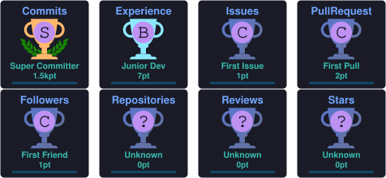

 

<!-- Education & Location Badges -->

  
  
  

<!-- Social & Contact Links -->

  
  
  
  

<!-- Profile Views & Followers -->

  
  
  

---

## 👨🏻‍💻 About Me

I am an **AI & ML Engineer and Full-Stack Developer** passionate about bridging the gap between machine learning research and scalable systems engineering. I care about the space between disciplines—understanding ML deeply enough to design the right model, and systems engineering deeply enough to ship it.

- 🔭 **Currently Building:** Production-ready intelligent systems using prompt-chaining architectures, few-shot tuning, and transfer learning.
- 🌱 **Deep Diving Into:** Offline-first system designs, zero-trust escrow logic, and real-time WebRTC mesh networking.
- 🎯 **Goal:** To architect systems that are as mathematically sound on the backend as they are performant on the frontend.
- 💼 **Open To:** Software Engineering Internships · AI/ML Engineering · GenAI Roles · Full-Stack Development.

---

## 🛠️ Tech Stack
 

### Languages

### 🎨 Frontend

### 🤖 AI / ML / Data

 

### ⚙️ Backend & DevOps

 

### 🔧 Tools & IDEs

---

## 🚀 Featured Projects

<b>💸 HarshPay — Offline-First P2P Digital Payment Ecosystem</b>

 
<blockquote>Hardware-agnostic offline payment platform enabling secure P2P transfers with zero network connectivity.</blockquote>

| Attribute | Detail |
|---|---|
| **Stack** | Flutter · Next.js · Node.js · MongoDB · WebRTC · Hive · Vercel |
| **Connectivity** | Offline-first via Google Nearby Connections, radio & optical QR transfer |
| **Security** | Zero-trust match-and-settle escrow engine, encrypted Hive local storage |
| **Settlement** | Atomic transaction settlement within a 24-hour TTL window |
| **Sync** | Reactive background queue (Riverpod) pushing offline ledgers on reconnect |
| **Links** | [GitHub Repository](https://github.com/Harshkumar2306/Harsh-Pay-App) · [Live Demo](https://harsh-bank.vercel.app/) |

**Impact:** Architected an offline-first P2P digital payment ecosystem eliminating double-spend vulnerabilities through independent cryptographic envelope verification, with autonomous background sync of offline ledger payloads to serverless APIs upon reconnection.

<b>💬 TalkToMe — Real-Time Communication Platform</b>

 
<blockquote>MERN-stack messaging and calling platform with peer-to-peer media streaming at zero relay cost.</blockquote>

| Attribute | Detail |
|---|---|
| **Stack** | MERN · Socket.io · WebRTC · React · Node.js · Express |
| **Scale** | 500+ concurrent connections |
| **Latency** | Near-zero latency (&lt;50ms) for messaging, typing indicators, presence |
| **Media** | WebRTC mesh topology for group audio/video, no centralized media server |
| **Storage** | Cloudinary integration for 1,000+ images, files, and voice notes |
| **Links** | [GitHub Repository](https://github.com/Harshkumar2306/talk-to-me) · [Live Demo](https://talk-to-me-pied.vercel.app/) |

**Impact:** Built a highly scalable platform with MongoDB schemas tailored for cross-session read receipts and peer-to-peer signaling, effectively scaling group calling without exorbitant relay infrastructure costs.

<b>🐠 Sea Animal Classifier — Fine-Grained Marine Species Classification</b>

 
<blockquote>Dual-head PyTorch vision model classifying 23 marine species with taxonomy-aware loss design.</blockquote>

| Attribute | Detail |
|---|---|
| **Stack** | Python · PyTorch · EfficientNetV2-M · FastAPI · React |
| **Performance** | 53.5M parameters · 94.16% top-1 accuracy · 0.99 ROC-AUC across 23 species |
| **Optimization** | +6.75% accuracy via EMA (+2.25%), TTA (+2.20%), Temperature Scaling |
| **Deployment** | React/Vite SPA on Vercel + CPU-optimized FastAPI Docker on Hugging Face Spaces |
| **Links** | [GitHub Repository](https://github.com/Harshkumar2306/Sea-Animal-Classifier) · [Live Demo](https://sea-animal-classifier.vercel.app/) |

**Impact:** Trained and deployed a fine-grained classification model integrating an autonomous AI research agent via the Wikipedia Action API, served through a decoupled cloud-native architecture. Class imbalance mitigated via WeightedRandomSampler.

<b>🌱 SmartAgro — Precision Agriculture Intelligence Platform</b>

 
<blockquote>Geospatial crop health platform combining satellite imagery, weather data, and clustering-based analysis.</blockquote>

| Attribute | Detail |
|---|---|
| **Stack** | React.js · FastAPI · Python · Scikit-learn · STAC API · Docker |
| **Processing** | Multi-threaded, non-blocking GIS GeoTIFF processing |
| **Analysis** | K-Means clustering on NDVI/NDWI multi-spectral indices for crop health zones |
| **Forecasting** | Nitrogen/water deficit calculation, canopy-moisture fungal outbreak radar |
| **Links** | [GitHub Repository](https://github.com/Harshkumar2306/SmartAgro) · [Live Demo](https://smart-agro-eight.vercel.app/) |

**Impact:** Decoupled platform deployed across Vercel and Hugging Face Spaces, applying agronomic algorithms and live weather correlation (Microsoft Planetary Computer + Open-Meteo) to forecast crop stress before it becomes visible.

---

## 💼 Experience
 
### GenAI & Prompt Engineering Intern — EduBot Technologies *(Govt. of AP Collaboration)*
`June 2025 – July 2025` · Vijayawada, AP
 
Built and shipped enterprise-grade GenAI tooling, taking features from prototype to production.
 
**Key Achievements:**
- Spearheaded **AutoPrompt Builder**, an enterprise prompt generation platform with template-based routing across 5 industry domains and configurable role, tone, and intent parameters.
- Designed a multi-step prompt chaining engine and parameter tuning dashboard with real-time output previews, accelerating prompt iteration speed by **2x**.
- Integrated a few-shot learning module and a Firebase-backed per-session rating system, reducing evaluation effort by **40%**.
- Shipped 3 core AI features to production on Render using Firebase Authentication and secure JSON/TXT export pipelines.

  
  
  
  
  

 
---

## 📜 Certifications

**Oracle** 

**Coursera** 

**Amazon Web Services** 

**APSCHE & EduBot** 

---

## 📊 GitHub Analytics

<table align="center" border="0" cellpadding="0" cellspacing="0" style="border-collapse: collapse; border: none;">
  <tr>
    <td align="center" valign="top" style="border: none; padding-right: 10px;">
      
    </td>
    <td align="center" valign="top" style="border: none; padding-left: 10px;">
      
    </td>
  </tr>
</table>
 

  

---

## 📈 Contribution Activity

  

---

## 📬 Let's Connect!

 

